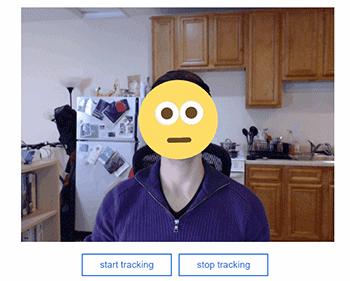

# Emojify

Live site at: [emojify](https://www.mikewesthad.com/emojify/)

Playing around with JavaScript face tracking.  Emojify tracks your face position and draws an emoji on top of it.  If you smile, the emoji smiles too.

_Note to self: morph this into a gulp-less teaching example._

## Installation

This project uses a gulp build process for development.  If you want a local copy of the project without having to build it yourself, you can download the `build/` folder.  (You will need to run it through a [local server](https://github.com/mrdoob/three.js/wiki/How-to-run-things-locally).)

If you want to build the project yourself, follow these steps:

1. Install [Node](https://nodejs.org/en/).
2. Install the gulp command line tool (globally) via terminal: `npm install -g gulp`.
3. Open at terminal at `emojify/` and install gulp dependencies: `npm install`.
4. Run the default gulp task from terminal: `gulp`.  This will build the site into the `build/` folder and up a local server on port 8080 where the built site can be viewed.  (E.g. [http://127.0.0.1:8080](http://127.0.0.1:8080))

## License
>You can check out the full license [here](https://github.com/mikewesthad/emojify/blob/master/license.md)

This project is licensed under the terms of the **MIT** license.
